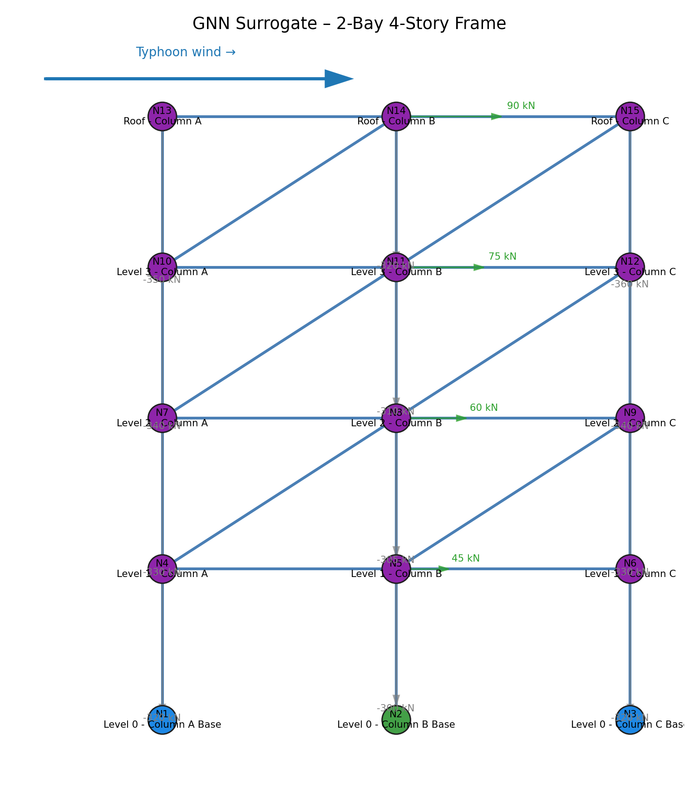

# GNN-Based Structural Analysis Visualization Tool 🏗️



## Overview

An advanced structural engineering analysis tool that leverages Graph Neural Networks (GNN) to interpret and visualize building frame responses under lateral wind and gravity loads. This educational toolkit is designed for graduate-level structural engineering courses, providing rich insights into load paths, displacement patterns, and structural behavior.

## Key Features

### Core Capabilities
- **GNN Surrogate Analysis**: Fast structural response predictions using neural network approximations
- **Interactive Visualization**: NetworkX-based stick diagrams with load arrows and displacement vectors
- **AI-Powered Insights**: OpenAI GPT integration for automated engineering explanations
- **Educational Focus**: Designed specifically for classroom instruction and student learning

### Analysis Outputs
- Node displacement magnitudes and patterns
- Member stress ratios and utilization factors
- Story drift calculations
- Load path visualization
- Base reaction summaries
- Critical weakness identification

## Installation

### Prerequisites
- Python 3.8+
- OpenAI API key (for report generation)

### Setup
```bash
# Clone the repository
git clone https://github.com/MinwooKim1990/structural_analysis.git
cd structural_analysis

# Install dependencies
pip install -r requirements.txt

# Set up environment variables
cp .env
# Edit .env and add your OPENAI_API_KEY
```

## Quick Start

### Basic Usage
```python
from GNN_support import StructuralInsightGenerator
import json

# Load your GNN output data
with open('SAMPLE_GNN_OUTPUT.json', 'r') as f:
    data = json.load(f)

# Initialize generator
generator = StructuralInsightGenerator(llm_model="gpt-4o-mini")

# Generate visualization
diagram_path = generator.visualize_structure(
    data,
    output_path=Path("output_diagram.png"),
    show_displacements=True
)

# Generate engineering report
report = generator.generate_report(data, diagram_path=diagram_path)
print(report)
```

### Demo Script
```bash
python GNN_support.py
```
This runs a complete demonstration with the sample 2-bay, 4-story frame data.

## Project Structure

```
structural-analysis/
├── GNN_support.py              # Main module with visualization and analysis tools
├── SAMPLE_GNN_OUTPUT.json      # Example GNN analysis output (2-bay, 4-story frame)
├── demo_structural_diagram.png # Sample visualization output
├── requirements.txt            # Python dependencies
├── .env                        # Environment variables (create from .env.example)
└── README.md                   # This file
```

## API Reference

### StructuralInsightGenerator

Main class for structural analysis visualization and reporting.

#### Constructor
```python
StructuralInsightGenerator(
    llm_model: str = "gpt-4o-mini",
    client: Optional[OpenAI] = None,
    llm_options: Optional[Dict[str, Any]] = None
)
```

#### Key Methods

##### `visualize_structure()`
Generate 2D stick diagram with load and displacement visualization.
```python
visualize_structure(
    payload: Dict[str, Any],
    output_path: Path,
    show_displacements: bool = True,
    figsize: Tuple[int, int] = (7, 8)
) -> Path
```

##### `derive_structural_metrics()`
Extract engineering metrics from raw GNN output.
```python
derive_structural_metrics(payload: Dict[str, Any]) -> Dict[str, Any]
```

##### `generate_report()`
Create comprehensive engineering analysis report using LLM.
```python
generate_report(
    payload: Dict[str, Any],
    diagram_path: Optional[Path] = None,
    temperature: float = 0.2
) -> str
```

## Visualization Details

### Color Coding
- 🔵 **Blue nodes**: Fixed supports
- 🟢 **Green nodes**: Pinned connections
- 🟠 **Orange nodes**: Roller supports
- 🟣 **Purple nodes**: Free nodes

### Arrow Conventions
- 🟢 **Green arrows**: Lateral wind loads (kN)
- ⬜ **Gray arrows**: Gravity loads (kN)
- 🔴 **Red arrows**: Displacement vectors (exaggerated scale)
- 🔵 **Blue arrow**: Global wind direction indicator

## Sample Output Structure

The tool generates comprehensive metrics including:

```json
{
  "summary": {
    "max_node_displacement_mm": {
      "node": "N8",
      "value": 45.231
    },
    "max_element_utilization": {
      "element": "B3",
      "stress_ratio": 0.892
    },
    "story_drifts_mm": [...],
    "base_reaction_totals_kN": {
      "Fx": 250.5,
      "Fy": 1850.3
    }
  }
}
```

## Educational Features

### Report Sections
The AI-generated reports include:
1. **Structure Overview** - Geometry, loads, and support conditions
2. **Node Response Summary** - Displacement and load analysis
3. **Load Path Explanation** - Force flow through the structure
4. **Visualization Notes** - How to interpret the diagrams
5. **Critical Weaknesses** - Overstressed members and serviceability issues
6. **Strengthening Strategies** - Retrofit recommendations
7. **Additional Observations** - Engineering practice insights

## Technical Details

### Dependencies
- **NetworkX**: Graph-based structural representation
- **Matplotlib**: Visualization engine
- **NumPy**: Numerical computations
- **OpenAI**: LLM integration for reports
- **python-dotenv**: Environment variable management

### Model Support
- Default: `gpt-4o-mini` (optimized for structural analysis)
- Alternative: `gpt-5-mini` (with reasoning capabilities)